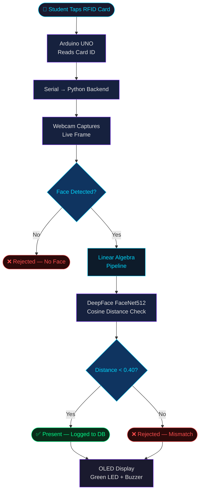
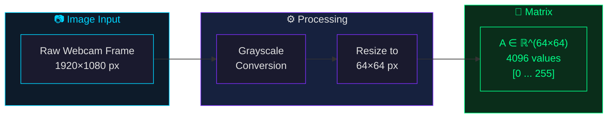
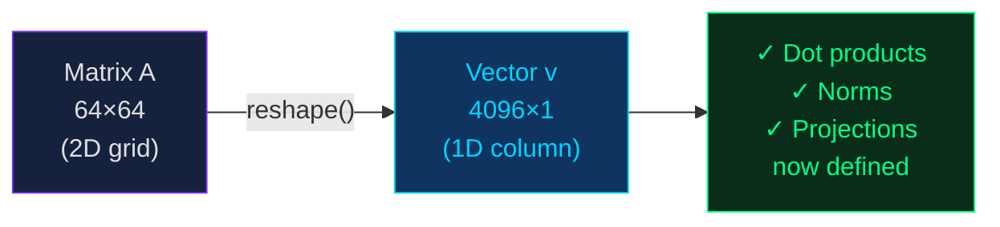
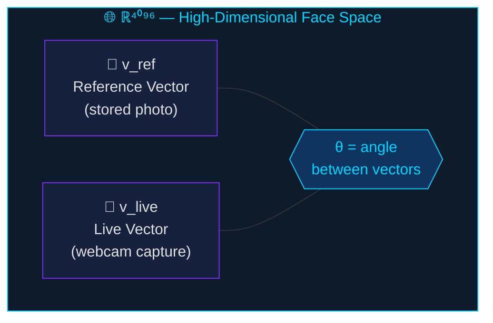
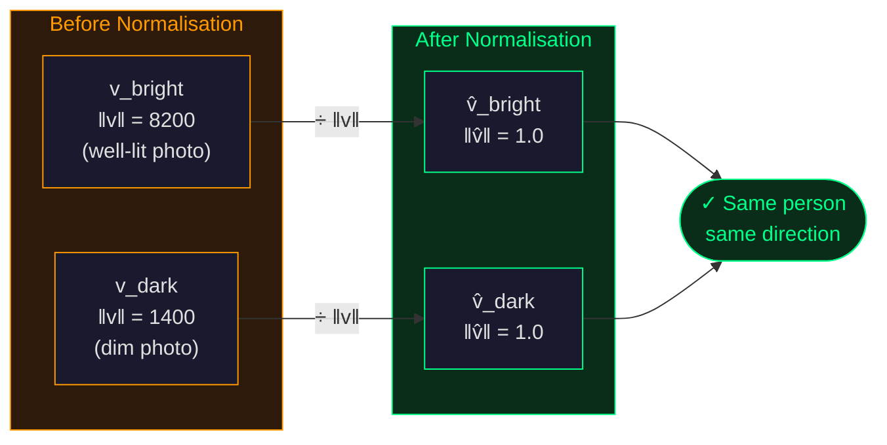
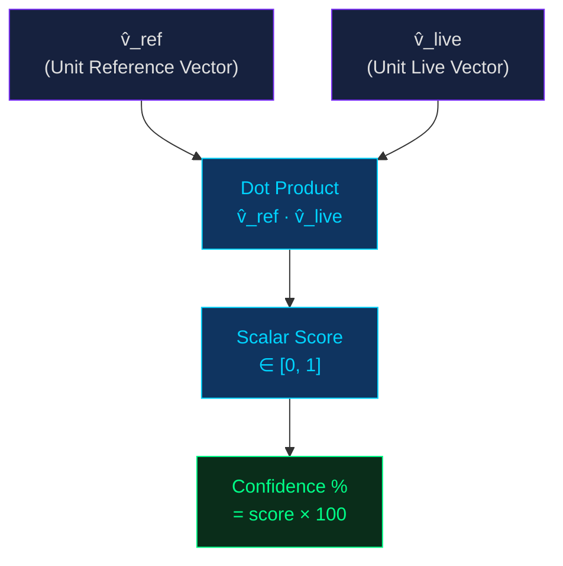
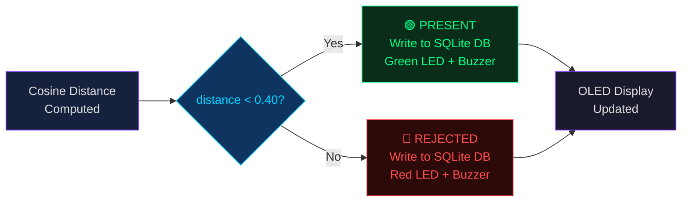

# ◈ Smart Attendance System
## RFID × Facial Recognition — Linear Algebra Pipeline

> **Course:** UE24MA241B – Linear Algebra and Its Applications

---

## ◈ Team Details

| Name | SRN |
|:---|:---|
| D Harikrishnan | PES1UG24CS136 |
| Dhawal Pathak | PES1UG24CS151 |
| Vivian Sobers E | PES1UG24CS901 |
| Aryan Upadhyay | PES1UG25CS806 |
---
 
## ◈ Problem Statement

Manual attendance is slow and prone to proxy marking. This project solves that by pairing **RFID card identification** with **real-time face verification**. When a student taps their card, the system reads their identity and immediately captures a live photo. A linear algebra pipeline then compares the live face against a stored reference image. The outcome — **Present** or **Rejected** — is logged to a database and displayed on the Arduino's OLED screen.

> The mathematical core is built entirely on **vector and matrix operations**: image data enters as a matrix, gets transformed and normalised into a unit vector, and identity is confirmed through orthogonal projection.

---

## ◈ System Architecture Overview

---

## ◈ Linear Algebra Pipeline

---

### Step 1 — Real-World Data → Matrix Representation

A face image loaded in grayscale maps each pixel to an intensity value between 0 (black) and 255 (white). Both the stored reference photo and the live webcam capture are resized to **64×64 pixels**:

$$A \in \mathbb{R}^{64 \times 64}$$

Each row of $A$ is a horizontal scan line; each entry is a brightness value. This is a direct application of matrices as linear transformations — the image is mapped from pixel space into a structured numerical form that algebraic operations can act on.

> **Topics Used:** Matrices · Linear Transformations · Matrix Representation of Data

---

### Step 2 — Matrix Simplification → Vectorisation

The 64×64 matrix is **flattened** into a single column vector of length 4096:

$$\mathbf{v} = \text{reshape}(A) \in \mathbb{R}^{4096}$$

This is a structure-preserving linear map — no pixel information is lost. The 2D layout is simply unrolled into 1D form, bringing the image into a space where dot products, norms, and projections apply directly.

> **Topics Used:** Linear Transformations · Matrix Reshaping

---

### Step 3 — Structure of the Space

Each face image, once flattened, is a **point in ℝ⁴⁰⁹⁶**. The reference image and the live capture are two vectors in this same high-dimensional space, and the goal is to determine how close they are in **direction**.

- The **column space** of the image matrix captures which intensity patterns are expressible by that face.
- The **rank** of the matrix indicates variation across the face — a plain image has low rank; a detailed face has higher rank.

> **Topics Used:** Vector Spaces and Subspaces · Column Space · Rank

---

### Step 4 — Remove Redundancy → Normalisation

Two photos of the same person under different lighting produce vectors of very different **magnitudes**. Normalisation removes this redundancy:

$$\hat{\mathbf{v}} = \frac{\mathbf{v}}{\|\mathbf{v}\|}$$

This projects both vectors onto the **unit hypersphere** in ℝ⁴⁰⁹⁶. After normalisation, only the **direction** matters — which corresponds to the geometric structure of the face, not the brightness.

> **Topics Used:** Norm and Unit Vectors · Basis Selection · Linear Independence

---

### Step 5 — Projection → Similarity Measurement

With both vectors normalised, similarity is computed via **orthogonal projection**. The live vector is projected onto the reference vector:

$$\text{projection} = \hat{\mathbf{v}}_{\text{ref}}^{\top} \times \hat{\mathbf{v}}_{\text{live}}$$

$$\text{confidence} = |\text{projection}| \times 100\%$$

This scalar measures how much of the live face vector aligns with the reference. When the two vectors point in nearly the same direction (same person), the projection is close to **1**. When they diverge (different person), the value drops toward **0**.

> **Topics Used:** Orthogonal Projections · Projection onto Subspaces · Dot Product as a Projection Operator

---

### Step 6 — Final Output → Attendance Decision

The projection score provides an interpretable similarity metric. The final decision uses a **DeepFace (FaceNet512) cosine distance check**:

$$\text{if distance} < 0.40 \Rightarrow \texttt{Status = Present}$$
$$\text{else} \Rightarrow \texttt{Status = Rejected}$$

Both scores are saved to a **SQLite database** alongside the student's SRN, name, timestamp, and captured photo path. The result is sent back to the Arduino over serial to update the OLED display and activate the green or red LED with a buzzer tone.

> **Topics Used:** Projection-based Similarity Scoring · Threshold Classification · Pattern Detection

---

## ◈ Full Pipeline Summary

| Stage | Concept | What It Does |
|:---|:---|:---|
| Real-World Data | Matrix Representation | Face image loaded as a 64×64 pixel matrix |
| Matrix Simplification | Linear Transformation | Matrix flattened to a 4096-length vector |
| Structure of the Space | Vector Spaces, Column Space, Rank | Face vectors placed in ℝ⁴⁰⁹⁶ |
| Remove Redundancy | Normalisation, Basis Selection | Unit vectors isolate facial geometry from brightness |
| Projection | Orthogonal Projection, Dot Product | Measures directional similarity between two face vectors |
| Final Output | Pattern Detection, Classification | Present or Rejected decision logged and displayed |

---

*Report generated for UE24MA241B — Linear Algebra and Its Applications*
